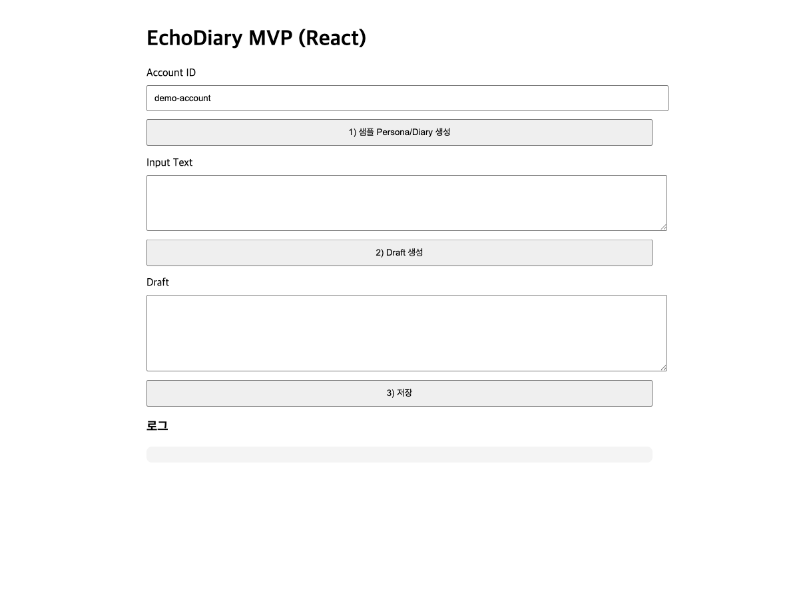
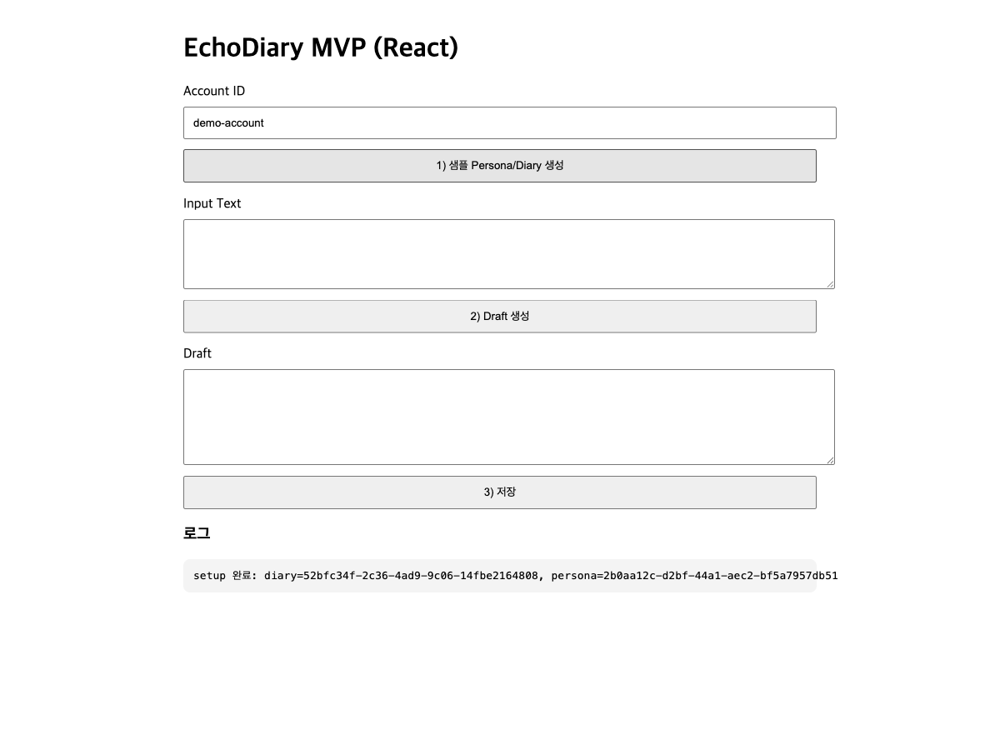
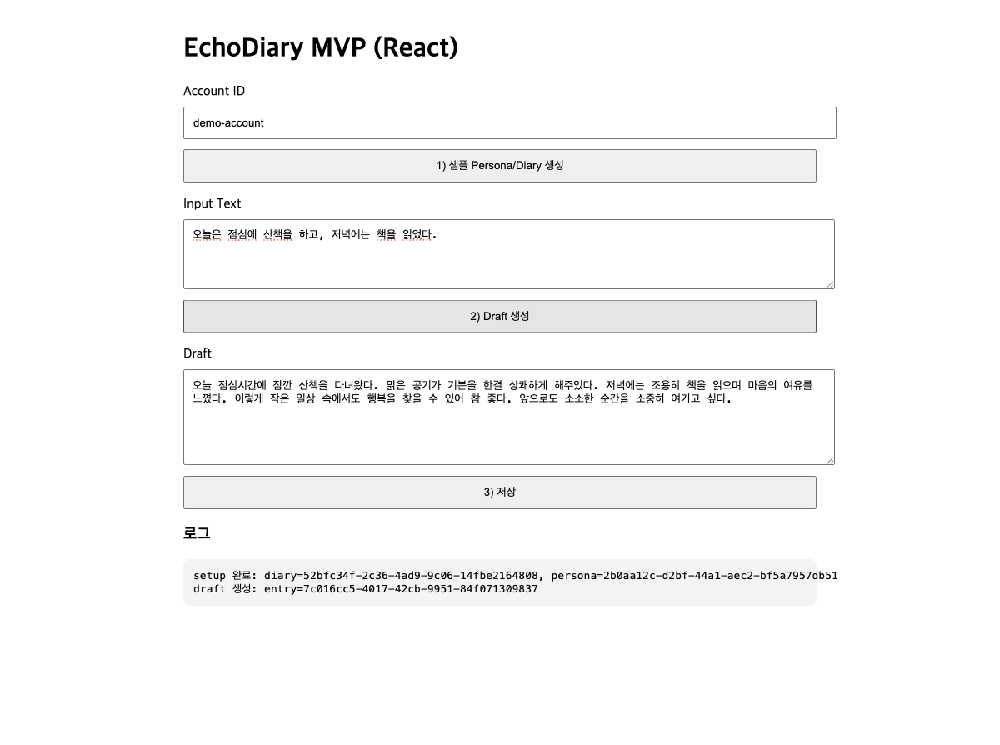
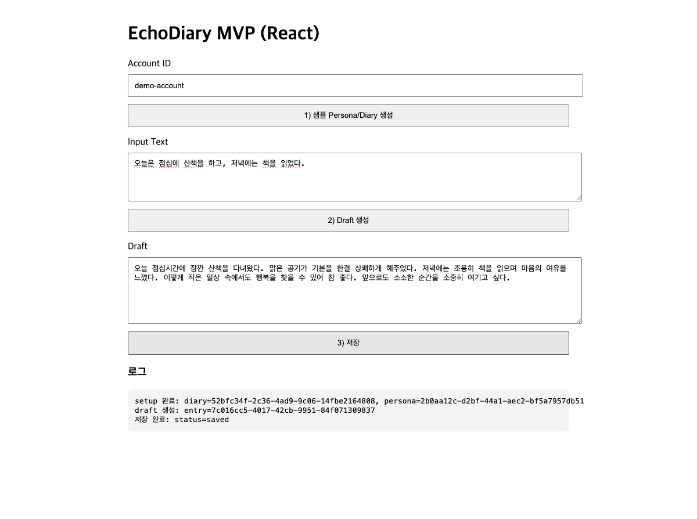

# Playwright 점검 기록 - 0101 현재 상태

- 점검 일시: 2026-02-27
- 점검 도구: Playwright MCP
- 대상 URL: `http://localhost:3000`
- 실행 환경: `docker compose` 기동 상태 (`api`, `frontend`, `db` 확인)

## 캡처 파일
### 1) 메인 화면 초기 진입

### 2) 샘플 Persona/Diary 생성 후

### 3) Draft 생성 후

### 4) 저장 후

## 동작 확인 시나리오
1. 메인 화면 접속 후 기본 UI 요소(계정, 입력, Draft, 로그 영역) 노출 확인.
2. `1) 샘플 Persona/Diary 생성` 클릭 후 로그에 diary/persona id 출력 확인.
3. 입력 텍스트 작성 후 `2) Draft 생성` 클릭, Draft textarea에 생성 문구 반영 확인.
4. `3) 저장` 클릭 후 로그에 `저장 완료: status=saved` 출력 확인.

## 비고
- 브라우저 콘솔에서 `favicon.ico 404` 1건 확인 (기능 동작에는 영향 없음).
