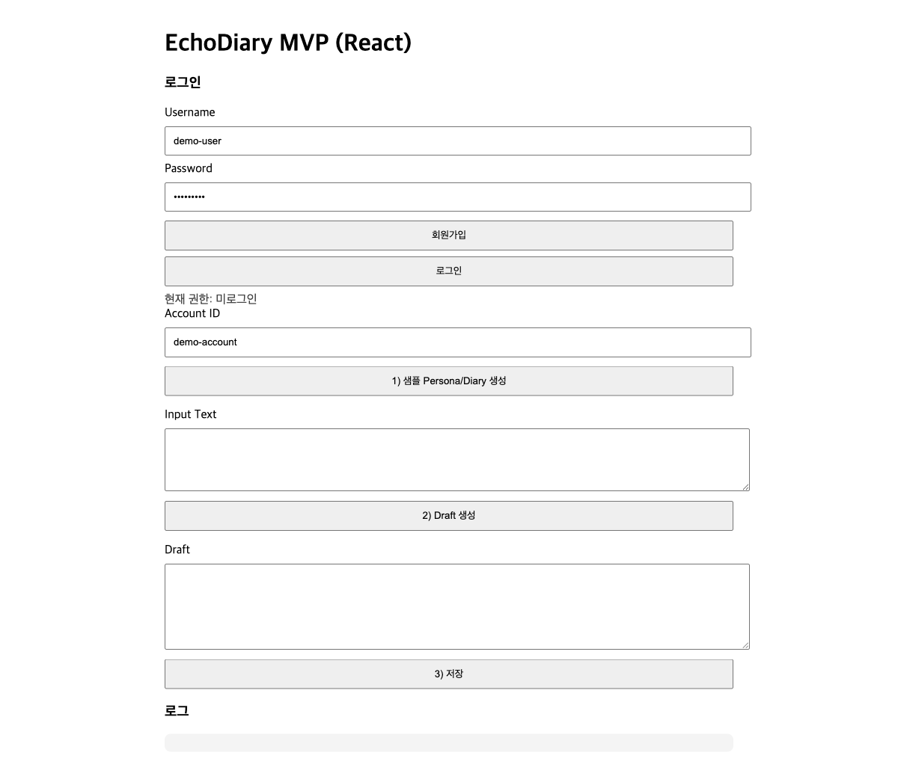
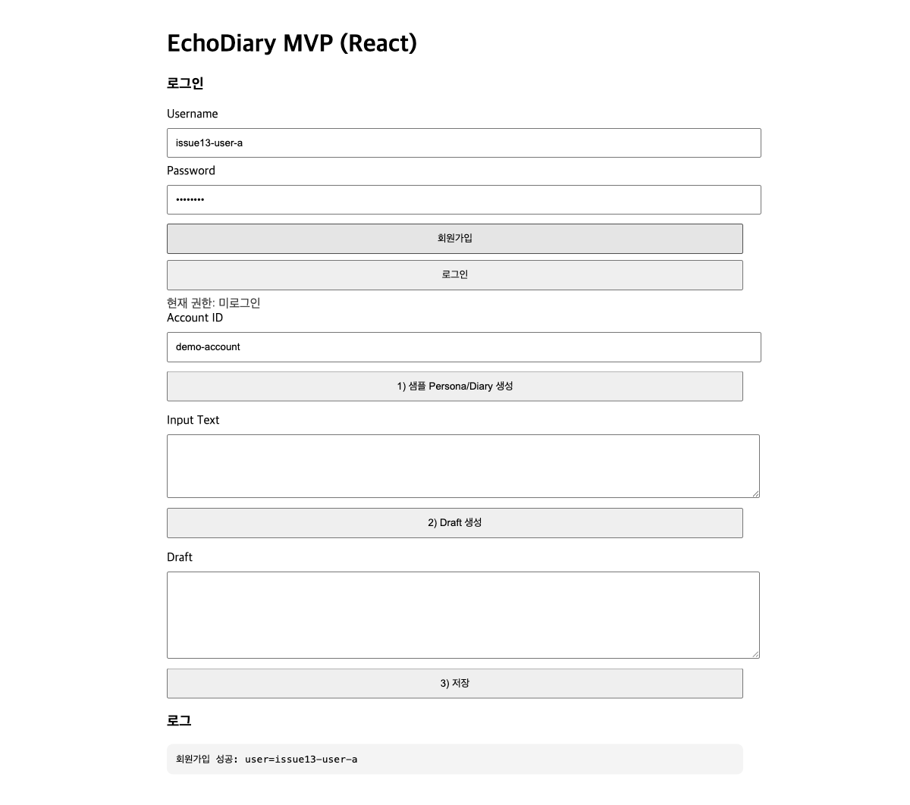
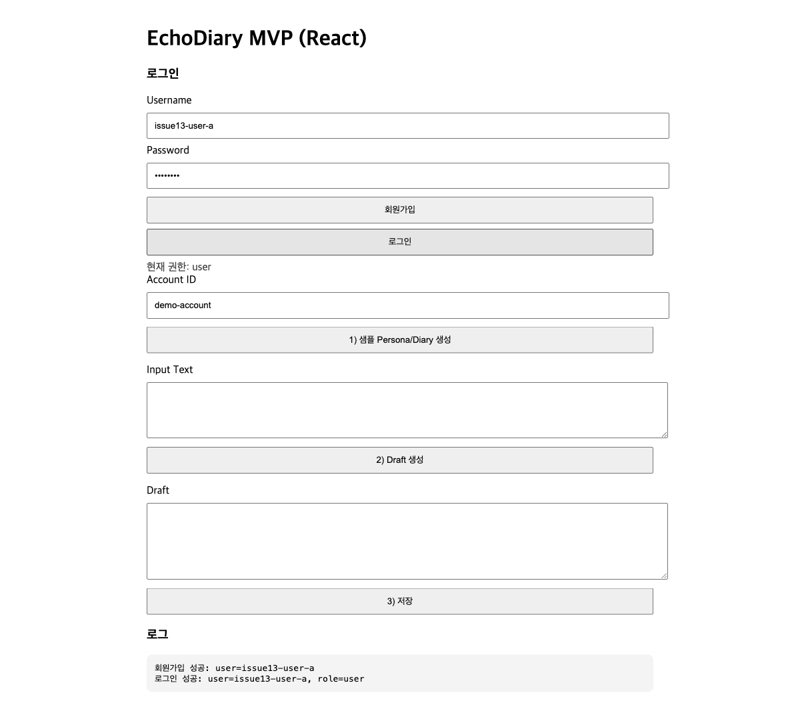
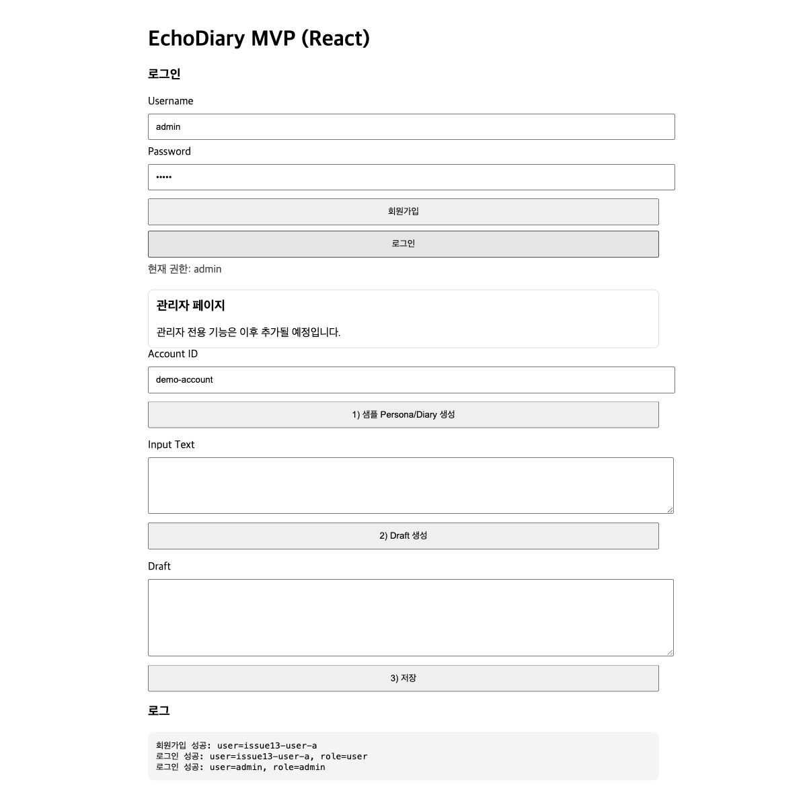

# 0102 - Issue #13 Auth/JWT Playwright Check

## 실행 환경
- Date: 2026-02-27
- URL: `http://localhost:3000`
- Scope: 회원가입/로그인(JWT), 일반 사용자/관리자 권한 UI 노출 확인

## 1) 초기 화면 (로그인 폼 노출)

- 로그인/회원가입 입력 영역이 표시됨
- 기본 기능 버튼(샘플 생성, Draft 생성, 저장) 접근 가능

## 2) 일반 사용자 회원가입 성공

- 계정 `issue13-user-a` / `pass1234`로 회원가입 수행
- 로그 영역에 회원가입 성공 메시지 표시 확인

## 3) 일반 사용자 로그인 성공

- 동일 계정으로 로그인 수행
- `현재 권한: user` 표시 확인
- 관리자 전용 섹션 미노출 확인

## 4) 관리자 로그인 성공

- 관리자 계정 `admin` / `admin` 로그인 수행
- `현재 권한: admin` 표시 확인
- 관리자 전용 섹션("관리자 페이지") 노출 확인

## 요약
- Issue #13 범위의 인증 플로우(회원가입/로그인/JWT 기반 권한 반영) UI 동작을 브라우저 기준으로 확인 완료.
