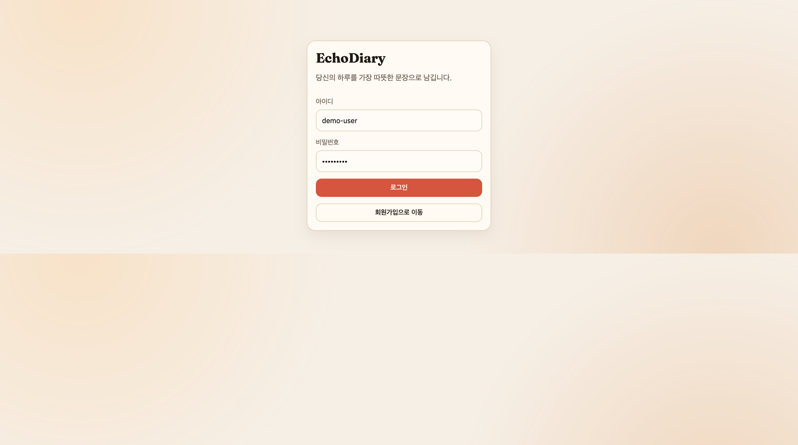
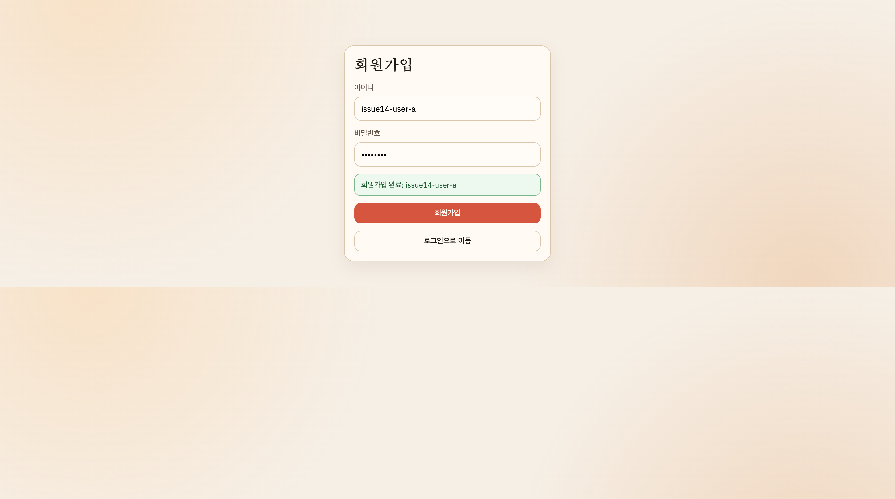
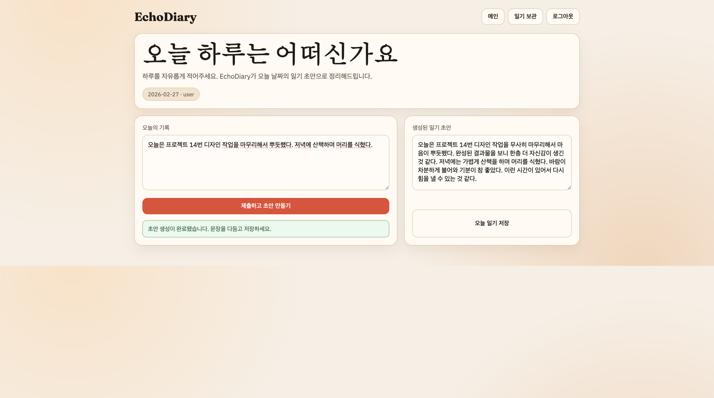
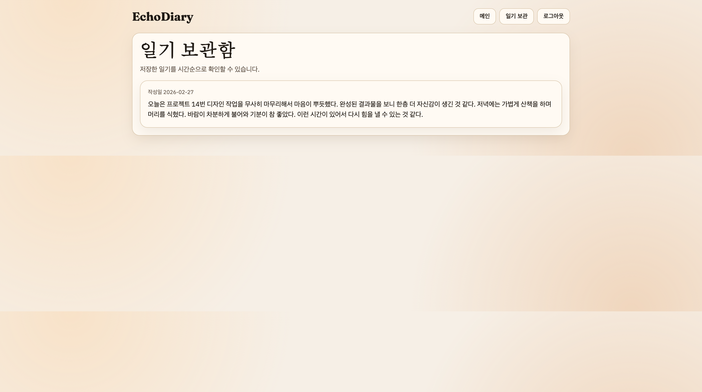

# 0103 - Issue #14 Main Redesign Playwright Check

## 실행 환경
- Date: 2026-02-27
- URL: `http://localhost:3000`
- Scope: 로그인/회원가입 분리 페이지, 메인 작성 동선, 저장 후 보관함 조회

## 1) 로그인 페이지

- `/login` 전용 화면 확인
- 인증 진입 동선이 메인 화면과 분리됨

## 2) 회원가입 성공

- `/signup` 화면에서 신규 계정 생성 성공 메시지 확인
- 계정: `issue14-user-a`

## 3) 메인 페이지 구조

- 로그인 후 `/` 진입
- "오늘 하루는 어떠신가요" 헤드라인과 단일 입력 동선 확인

## 4) 초안 생성 완료

- 오늘 기록 입력 후 `제출하고 초안 만들기` 실행
- 생성 완료 상태 메시지와 초안 텍스트 표시 확인

## 5) 저장 완료 상태

- `오늘 일기 저장` 실행 후 저장 성공 메시지 확인

## 6) 일기 보관함 조회

- `/diaries` 페이지에서 저장된 일기 노출 확인
- 작성일(오늘 날짜) + 저장 본문 표시 확인

## 요약
- 이슈 #14 댓글 요구사항(프로덕션 톤 메인, 오늘 하루 입력/생성/저장, 보관함 조회, 회원가입/로그인 분리)을 브라우저 흐름으로 검증 완료.
