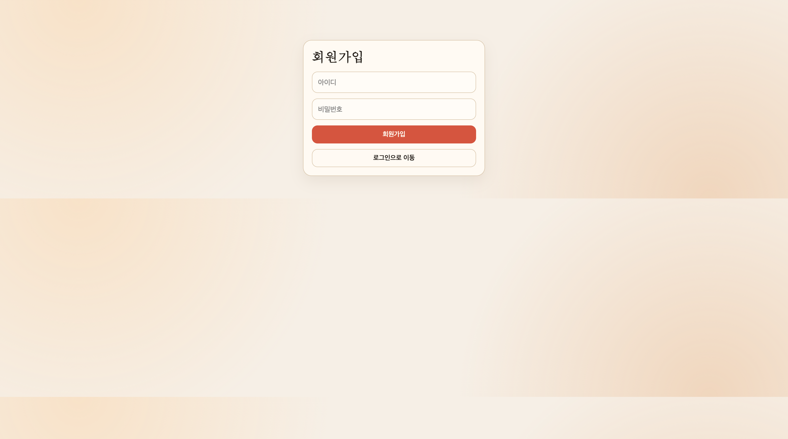
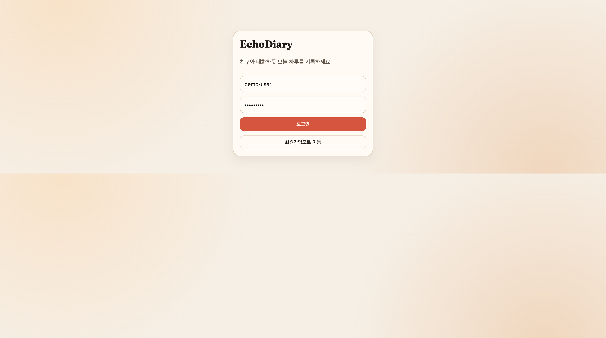
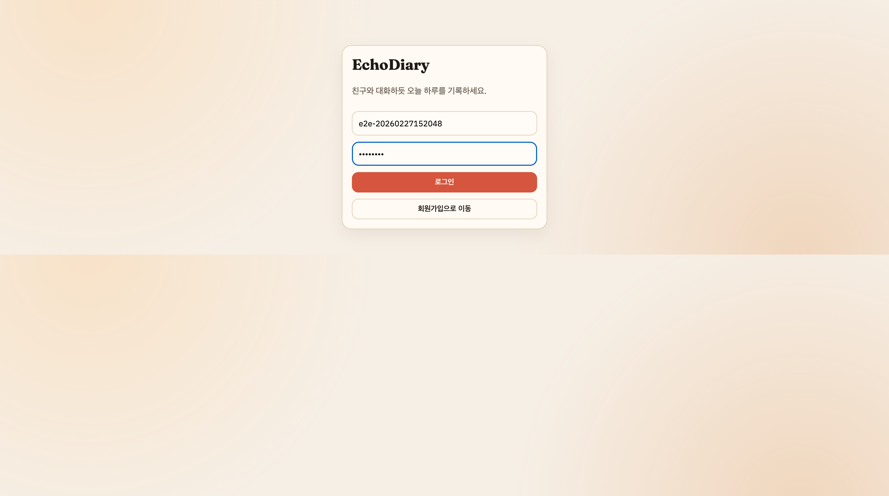
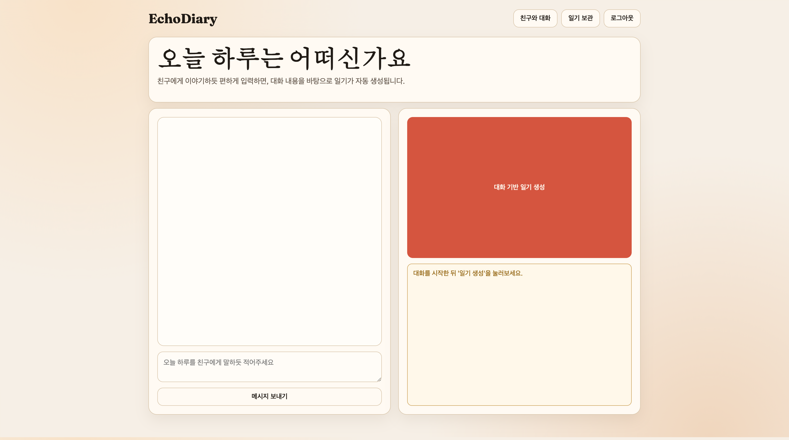
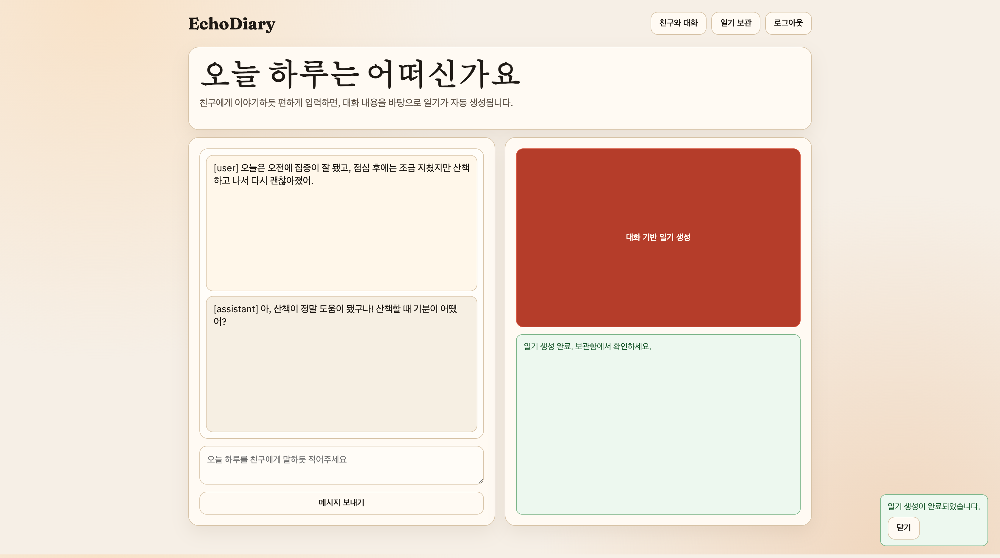
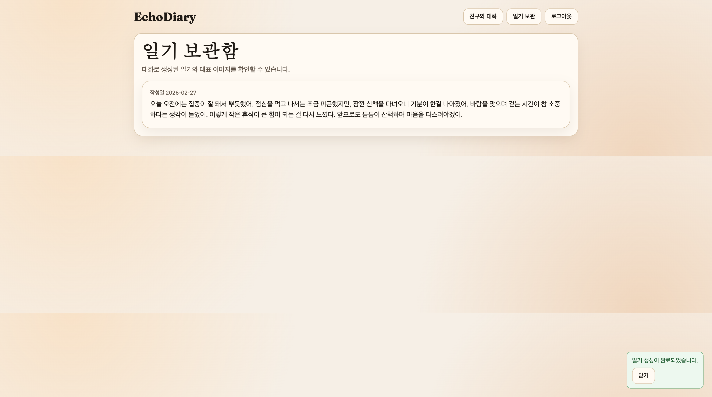

# 0104 - Project 17 Chatbot/Background/Image Check

실행 일시: 2026-02-27
환경: `docker compose` (frontend/api/db/minio)

## 시나리오
1. 회원가입
2. 로그인
3. 친구 대화 1회 이상 전송
4. `대화 기반 일기 생성` 실행
5. 생성 완료 알림 확인
6. `일기 보관`에서 생성된 일기 확인

## 단계별 캡처

### 1) 회원가입 화면

### 2) 회원가입 입력

### 3) 회원가입 완료

### 4) 로그인 입력

### 5) 채팅 초기

### 6) 메시지 전송 후 어시스턴트 응답

### 7) 백그라운드 생성 완료 토스트

### 8) 일기 보관함 진입

## 확인 결과
- 회원가입/로그인/대화/백그라운드 생성 완료 토스트까지 정상 동작.
- 생성된 일기 텍스트와 대표 이미지가 보관함에서 정상 표시됨.
- Playwright 재확인 기준 `img.entry-image` 로드 완료(`naturalWidth=1024`, `naturalHeight=1024`).

## 참고
- 이미지 API 사이즈 호환성 이슈를 반영해 백엔드 `OPENAI_IMAGE_SIZE` 기본값을 `1024x1024`로 조정함.
- 프론트는 현재 이미지를 `/api/entries/{id}/image`에서 받아 `blob:` URL로 렌더링함.
